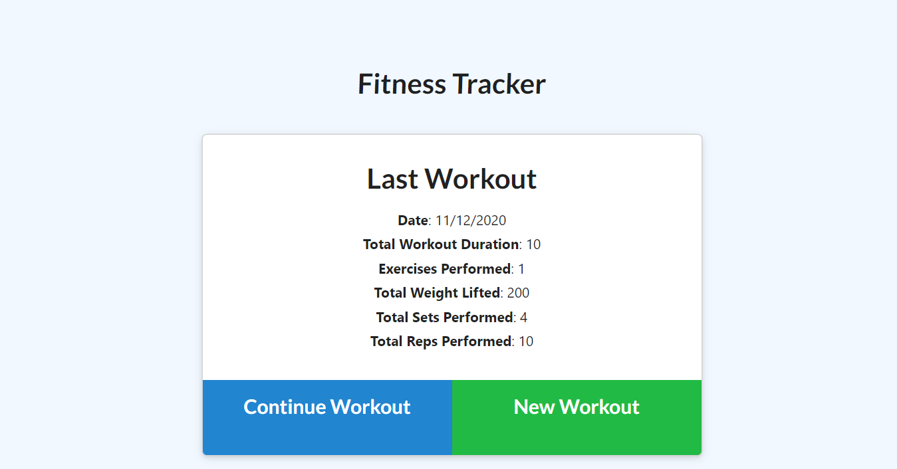
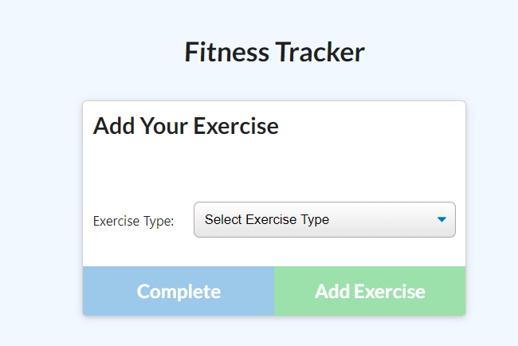
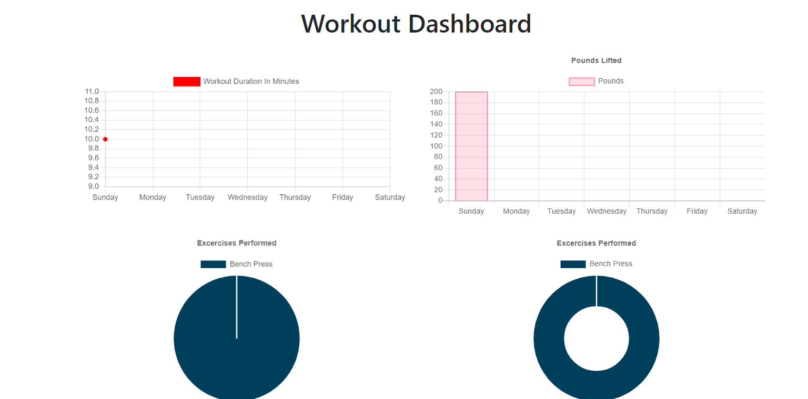

# Workout Tracker
  
   
  

  ## Description

  When the user loads the page, they will be given an option to add a new workout or continue their last workout. If the user clicks on new workout, they will be directed to a page that will ask them if they want resistance or cardio workouts. If the user chooses resistance,tThey will then add what workout they performed, how many reps, how many sets, and the duration of their workout. If the user chooses cardio, they will enter what cardio exercise they performed, how many miles they went and how long the exercise was performed for. Back at the homepage, whatever info the user inputed, will appear under last workout with the information they inputed about the workout. In the top left corner, the user can click dashboard, which will take them to a chart that logs all of their workout information.

  
  
  
  
  https://workout-trackerz.herokuapp.com/?id=5fadb0406f99910017083edd
  ## Table of Contents
  * [Installation](#installation)
  * [Usage](#usage)
  * [Contribution](#contribution)
  * [License](#license)
  * [Technology](#technology)
  ## Installation
  
  This project is hosted on heroku so anyone can access this without installing. However, if you wish to contribute to the app, you must install express, morgan, and mongoose.
  
  
  ## Usage
  
  follow the prompts given on the webpage. Refer to description for more information.
  
  ## Technology
  * MongoDb
  * Express
  * HTML
  * CSS
  * JavaScript ES6
  
  
  ## Contribution
  
  Anyone is free to contribute to improve functionality, UI, and overall performance.
  
  
  ## License
  
  MIT License
  
  
  ## Questions?
  
  If you have any questions, please contact me with the information below:
  Email: oballematt@gmail.com

  Github [@oballematt](https://github.com/oballematt)
  
